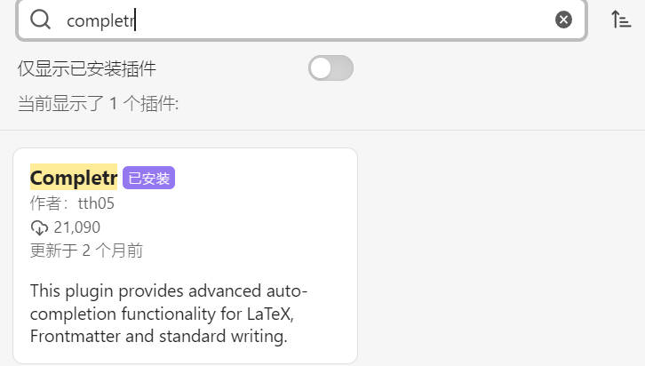

# Obsidian_intro

## 1.快速入门

### 安装

有条件的情况可直接选择最新版下载：[Github-obsidian-releases](https://github.com/obsidianmd/obsidian-releases)

注意直接双击 `.exe` 文件安装的 C 盘，后续可更改仓库目录。

1. 安装后打开软件，新建本地仓库

   

2. 设定仓库名称和位置

   

### 基础设置

特别注意设置**附件的默认存放路径**，这里主要针对的是直接粘贴图片的设置，即将附件放置在当前文件夹下的 `img` 子文件中，主要配合 [Snipaste](https://docs.snipaste.com/download) 使用。

### 主题

[主题导航网址](https://github.com/kmaasrud/awesome-obsidian)

- [Warmth Obsidian theme](https://github.com/chad-bennett/warmth-obsidian-theme) 暖色系(推荐)
- [Blue-Topaz_Obsidian](https://github.com/whyt-byte/Blue-Topaz_Obsidian-css) 教程齐全，对用户友好
- [obsidian-california-coast-theme](https://github.com/mgmeyers/obsidian-california-coast-theme) 半透明清新界面

## 2.插件

### 插件安装说明

1.会魔法的可直接搜索下载，注意先关闭安全模式。

2.不会魔法的[用户指南](https://zhuanlan.zhihu.com/p/497015024)

### Completr

功能：latex 代码自动补全功能，据说会和 Various Complements 的插件冲突，暂时未检验。

### obsidian-zotero-integration

[obsidian-zotero-integration](https://github.com/mgmeyers/obsidian-zotero-integration)

功能：与 zotero 中的英文文献联动，待探索。

### Obsidian Query Control

[Obsidian Query Control](https://github.com/nothingislost/obsidian-query-control)

功能：实现 Obsidian 搜索结果的 Markdown 结果渲染，在 Obsidian 搜出出来的，不再是一个个文本片段，而是包含 Markdown 语法渲染是实时渲染结果。

### DataView

[DataView](https://github.com/blacksmithgu/obsidian-dataview)

功能：用来管理文件

### BibNotes Formatter

[BibNotes Formatter](https://github.com/stefanopagliari/bibnotes/releases)

功能：用来将 .json 文件生成 .md 文件，建议会魔法的直接通过 [BRAT plugin](https://github.com/TfTHacker/obsidian42-brat/) 安装，更加便捷。

其他方式的安装步骤：1.下载安装包，一般有 `main.js, manifest.js, style.css` 等。

2.解压后放到设置的本地的仓库中去：`×××\obsidian_repository\.obsidian\plugins`

（如 `E:\Obsidian.1.1.16\obsidian_repository\.obsidian\plugins`），同时手动创建个文件夹 `bibnotes`，用来存放安装的文件。

### Unused Images

Unused Images 和 File Cleaner

功能：删除无用的图片和文件夹

## 3.联动设置

### zotero 联动设置

[方法总结参考教程(含 B 站视频讲解)](https://zhuanlan.zhihu.com/p/553181373?utm_id=0)

**1.老方法 (不推荐使用 Citations)**

**zotero插件**：[Better bibtex](https://retorque.re/zotero-better-bibtex/)

**obsidian插件**：Citations

**2.新方法**

**Zotero**：

- **[Zotero-markdb-connect](https://github.com/daeh/zotero-markdb-connect)（旧名称 Zotero Obsidian Citations）**
- [**Better BibTex**](https://retorque.re/zotero-better-bibtex/)

**Obsidian**:

- [**BibNotes Formatter**](https://github.com/stefanopagliari/bibnotes/releases)

[推荐安装教程](https://blog.csdn.net/qq_43309940/article/details/125150487)

[Zotero Obsidian Citations 版的安装教程](https://zhuanlan.zhihu.com/p/483844415)

**3.不使用 Zotero**

[视频讲解](https://www.bilibili.com/video/BV1AG4y1q7hU/?spm_id_from=333.337.search-card.all.click&vd_source=412ee9f1892496b8506f8302ac9d1437)

仅在 Zotero 中安装 [Zotero-better-notes](https://github.com/windingwind/zotero-better-notes)
